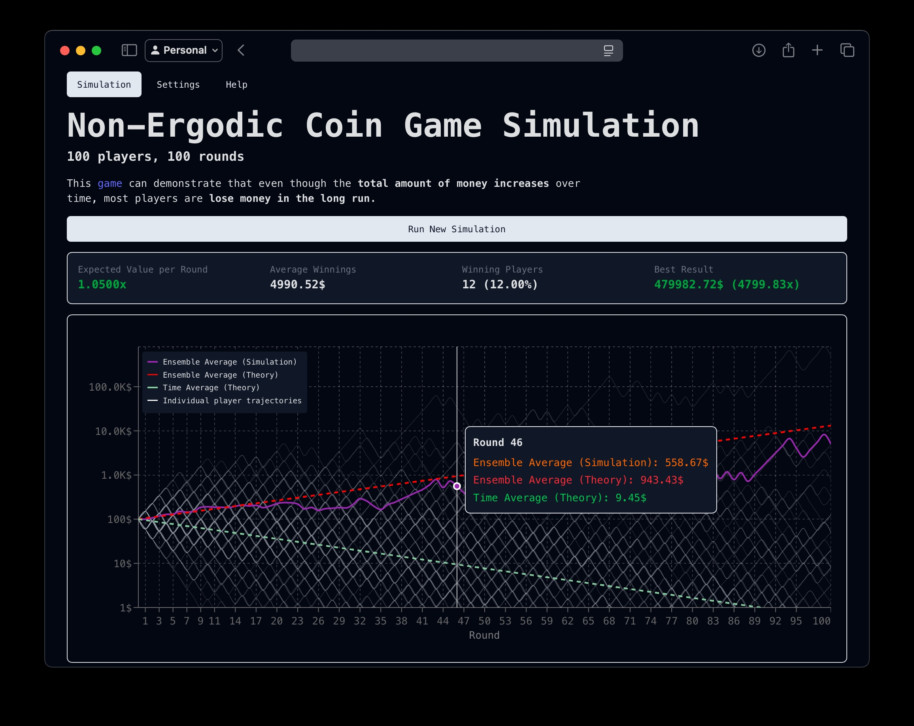

# Non-Ergodic Coin Game

The Non-Ergodic Coin Game is an interactive simulation that demonstrates the concept of non-ergodicity in probability and statistics.
This application visualizes how ensemble averages can differ from time averages in certain stochastic processes, a key concept in understanding risk and decision-making under uncertainty.



## Game

This project simulates a game where players start with the same capital and bet on coin flips. Each round, players either gain or lose a percentage of their capital. The simulation visualizes how player capital evolves over time and compares theoretical vs. actual results.

## Features

- Interactive coin-flipping simulation
- Real-time visualization of wealth trajectories
- Comparison between ensemble averages and individual outcomes
- Customizable parameters to explore different scenarios
- Statistical analysis of simulation results

### Key Concepts

- **Ensemble Average**: Average capital of all players at a specific time.
- **Time Average**: Average capital of a single player over time.
- **Ergodicity**: When time and ensemble averages coincide.

## Develop

Clone the repo, navigate to the directory, install dependencies, and start the development server:

```bash
# Clone the repository
git clone git@github.com:petersolopov/non-ergodic-coin-game.git
cd non-ergodic-coin-game
# Install dependencies
npm install
# Start development server
npm run dev
```

Building for Production:

```bash
npm run build
```

## License

MIT License. See [LICENSE](LICENSE) for details.

## Acknowledgements

Inspired by the [work of Ole Peters](https://www.nature.com/articles/s41567-019-0732-0) on ergodicity economics and the mathematics of non-ergodic processes.
